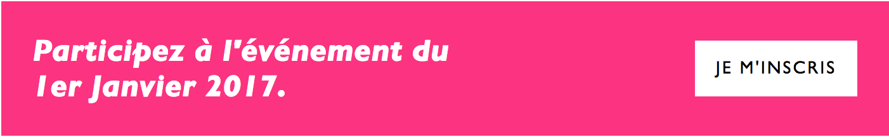
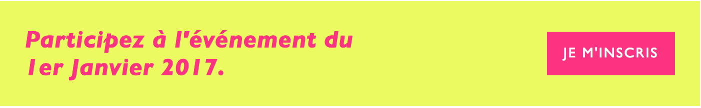

# Styleguide du contenu

## Typographie
Le titre de l'article sera interpreté en tant que `h1`.
Le sous-titre de l'article sera interpreté en tant que `h2`.

Donc les titres à l'interieur de l'article devront utiliser le markup de `h3` ou `h4`.

```
### Ceci est un titre à l'intérieur d'un article
```

## Images

Par default, l'image principale de l'article s'affichera en full width. Si votre image n'est pas
d'assez bonne qualité ou sa largeur < 1200px, ajoutez la dans le contenu de l'article, et utilisez les displays suivants:   

Image centrée (sa largeur est < 725px):
```
<figure>
    
</figure>
```

Image aussi large que le corps de l'article (sa largeur doit être > 725px):
```
<figure class="large">
    
</figure>
```

Image moins large que le corps de l'article (sa largeur est de minimum 500px):
```
<figure class="small">
    
</figure>
```

Ajouter une legende:
```
<figure>
    
    <figcaption>Ceci est une legende.</figcaption>
</figure>
```

Dans le cas où une image possède un lien, ajouter la classe `link--no-decor` dans le lien entourant l'image. Cela
évitera à l'image d'avoir une bordure.
```
<a href="http://en-marche.fr" class="link--no-decor">
    
</a>
```


## Videos

Les iframes de vidéos doivent être entourées de la classe `.video`.

```
<div class="video">
    <iframe width="560" height="315" src="https://www.youtube-nocookie.com/embed/DKimfuAWNvQ?rel=0" frameborder="0" allowfullscreen></iframe>
</div>
```

## Citations

Entourez les citations des tags `figure`, `blockquote` et `span`.
Si vous voulez l'attribuer un `figcaption` à l'interieur de la `figure`.


Une citation courte, large et centrée:
```
<figure class="blockquote--short">
    <blockquote>
        <span>«Tout commence par la rénovation de l’engagement politique.»</span>
    </blockquote>
    <figcaption>Emmanuel Macron, le 12 juillet 2016</figcaption>
</figure>
```

Une citation longue, présentée en bloc:
```
<figure class="blockquote--long">
    <blockquote>
        <span>«Tout commence par la rénovation de l’engagement politique.»</span>
    </blockquote>
    <figcaption>Emmanuel Macron, le 12 juillet 2016</figcaption>
</figure>
```

## Listes

Les listes numérotées:

```
* Item 1
* A second item
* Number 3
```

Les listes à puces:
```
1. Item 1
2. A second item
3. Number 3
```

Les listes à gros points bleus:

```
<ul class="dots">
    <li>Item 1</li>
    <li>Item 2</li>
    <li>Item 3</li>
</ul>
```

Les listes à flêches:

```
<ul class="arrows">
    <li>Item 1</li>
    <li>Item 2</li>
    <li>Item 3</li>
</ul>
```

Une liste avec un lien bleu:

```
<ul class="arrows blue">
    <li><a href="">Ceci est un lien bleu</a></li>
</ul>
```


## Indentation
Permet une indentation d'un paragraphe avec la même profondeur que les listes ci-dessus.

```
<p class="indent">La France est riche d’une histoire mais aussi d’un avenir que nous sommes en train d’écrire.</p>
```

## Les appels à action

NB : ils ne sont pas disponibles sur les sites départementaux.

La version défault:

```
<div class="action">
    <p>Participez à l'événement du 1er Janvier 2017.</p>
    <a href="[votre lien]">Je m'inscris</a>
</div>
```


Vous avez aussi l'option de changer la couleur du fond, de la typographie, et du bouton d'action.
- bleu: ajoutez la classe `blue`
- vert: ajoutez la classe `green`
- jaune: ajoutez la classe `yellow`
- rose: ajoutez la classe `pink`
- noir: ajoutez la classe `black`

Comme ceci:

```
<div class="action yellow">
    <p class="pink">Participez à l'événement du 1er Janvier 2017.</p>
    <a href="[votre lien]" class="pink">Je m'inscris</a>
</div>
```



Pour ne pas limiter la largeur du texte:
```
<div class="action action--full-text">
    <p>Participez à l'événement du 1er Janvier 2017.</p>
    <a href="[votre lien]">Je m'inscris</a>
</div>
```
